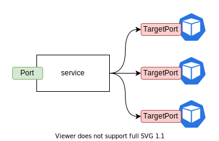

支持
- ClusterIP：只会在 k8s 集群内访问
- NodePort：基于 ClusetrIP 之上，还会在每一个 Node 上暴露端口
- LoadBalancer：基于 NodePort 之上，通过外部（云服务商）指定的 LB
- ExternalName：只是一个别名（CANME record）

Q: Port 和 TargetPort 有什么区别？

Port 指的是 service 对外提暴露服务的端口，但是 TargetPort 表示后端的 RS（pod）对外提供服务的端口。两者的所处的位置如下图所示，在大部分场景下，可以保持两者一致。另外：
- 1. TargetPort 是可选的，如果为空默认和 Port 保持一致
- 2. TargetPort 支持 IntOrString，如果为 String，会去匹配 pod.Spec.Containers[i].Ports[j].Name 字段来确定使用的端口

Q： Headless Service 和普通的 service 有什么区别？

Q: Headless service 的用途是？

Q：后端挂的 RS 故障了会怎么样？

Q：都支持多少类型的 service？

Q： 底层都是怎么实现的？

Q：在后端 RS 存在多个时，都是怎么选择后端的 pod 的？

Q：不同的 CNI 实现会影响选择后端 RS 的策略吗？

# 参考文档
- 《深入剖析 kubernetes》

